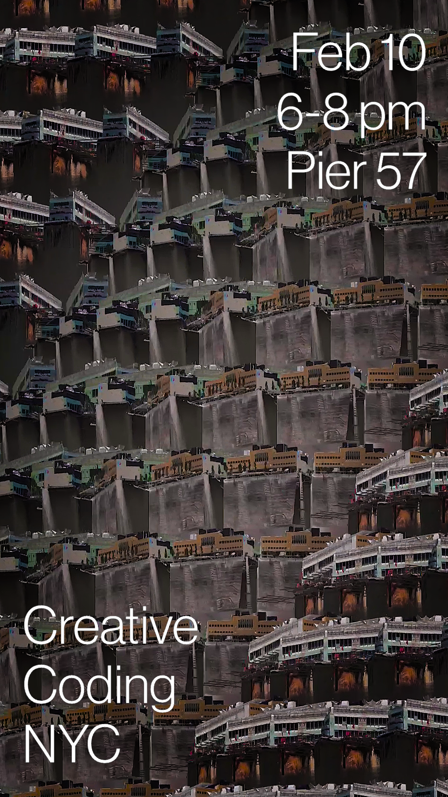

# Creative Coding NYC — February 10, 2026

Poster and promotional video for the Creative Coding NYC meetup on February 10, 2026, at Pier 57, 6–8 PM.

## Workflow

- **`poster.html`** — Generates the poster visual (background imagery).
- **`text.html`** — Generates individually animated letters using CSS animations.
- Screen recordings of both pages were captured and composited in Adobe Premiere to produce the final video.

## Final Result

See the animated version on [Instagram](https://www.instagram.com/p/DUhIHIZDYmm/).

## Image Pipeline

The imagery is captured from a custom rendering pipeline that is currently a work in progress. It will be made available and open-sourced later.

## Copyright

Some screenshots from [Google Photorealistic 3D Tiles](https://developers.google.com/maps/documentation/tile/3d-tiles-overview) are used in this project. Copyright for those images belongs to Google.
